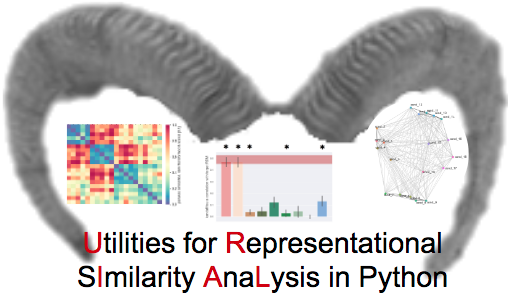

# URIAL -   Utilities for Representational sImilarity AnaLysis in python 

<<<<<<< Updated upstream
## Description
URIAL is a toolbox (and hopefully soon BIDS app) for [representational similarity analysis](https://doi.org/10.3389/neuro.06.004.2008) in python. In more detail, it includes functions for computing, plotting and comparing Representational Dissimilarity Matrices (RDMs). Its based on the famous [matlab toolbox](https://journals.plos.org/ploscompbiol/article?id=10.1371/journal.pcbi.1003553) ([github repo](https://github.com/rsagroup/rsatoolbox)), extending it with a variety of utility functions like the conversion from MATLAB (e.g., .mat) to open file types (e.g., .csv) and customizable graphics for both RDMs and MDS.  
=======
>>>>>>> Stashed changes

