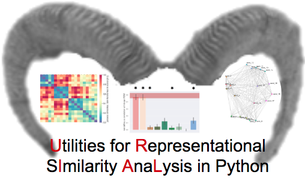

.. image:: https://img.shields.io/github/issues/PeerHerholz/URIAL.svg
    :alt: Issues
    :target: https://github.com/PeerHerholz/URIAL/issues/
<<<<<<< HEAD

.. image:: https://img.shields.io/github/issues-pr/PeerHerholz/URIAL.svg
    :alt: PRs
    :target: https://github.com/PeerHerholz/URIAL/pulls/

.. image:: https://img.shields.io/github/contributors/PeerHerholz/URIAL.svg
    :alt: Contributors
    :target: https://GitHub.com/PeerHerholz/URIAL/graphs/contributors/

.. image:: https://github-basic-badges.herokuapp.com/commits/PeerHerholz/URIAL.svg
    :alt: Commits
    :target: https://github.com/PeerHerholz/URIAL/commits/master

.. image:: http://hits.dwyl.io/PeerHerholz/URIAL.svg
    :alt: Hits
    :target: http://hits.dwyl.io/PeerHerholz/URIAL

=======
    
.. image:: https://img.shields.io/github/issues-pr/PeerHerholz/URIAL.svg
    :alt: PRs
    :target: https://github.com/PeerHerholz/URIAL/pulls/
 
.. image:: https://img.shields.io/github/contributors/PeerHerholz/URIAL.svg
    :alt: Contributors
    :target: https://GitHub.com/PeerHerholz/URIAL/graphs/contributors/
    
.. image:: https://github-basic-badges.herokuapp.com/commits/PeerHerholz/URIAL.svg
    :alt: Commits
    :target: https://github.com/PeerHerholz/URIAL/commits/master
    
.. image:: http://hits.dwyl.io/PeerHerholz/URIAL.svg
    :alt: Hits
    :target: http://hits.dwyl.io/PeerHerholz/URIAL
    
>>>>>>> 079d0310ad2b13f2c1c324dc06487e79a51ddf9f
.. image:: https://img.shields.io/badge/License-BSD%203--Clause-blue.svg
    :alt: License
    :target: https://opensource.org/licenses/BSD-3-Clause

Description
===========
URIAL is a toolbox (and hopefully soon BIDS app) for `representational similarity analysis <https://doi.org/10.3389/neuro.06.004.2008>`_ in python. In more detail, it includes functions for computing, plotting and comparing Representational Dissimilarity Matrices (RDMs). It's based on the famous `matlab toolbox <https://journals.plos.org/ploscompbiol/article?id=10.1371/journal.pcbi.1003553>`_ (`github repo <https://github.com/rsagroup/rsatoolbox>`_), extending it with a variety of utility functions like the conversion from MATLAB (e.g., .mat) to open file types (e.g., .csv) and customizable graphics for both RDMs and MDS, as well as correlation of RDMs across trials. It heavily utilizes the following python libraries: `pandas <https://pandas.pydata.org/>`_, `pingouin <https://github.com/raphaelvallat/pingouin>`_, `scikit-learn <https://scikit-learn.org/>`_, `nilearn <http://nilearn.github.io/index.html>`_, `nistats <https://nistats.github.io/>`_ & `MNE <https://martinos.org/mne/stable/index.html>`_.
<<<<<<< HEAD

Overview of functionality
=========================
As mentioned above, URIAL's is divided into three sections that include respective functions:

=======

Overview of functionality
=========================
As mentioned above, URIAL's is divided into three sections that include respective functions:

>>>>>>> 079d0310ad2b13f2c1c324dc06487e79a51ddf9f
Computing
_________
- computation of RDMs from neuroimaging data, including fMRI (within ROIs) & EEG (across time)
- generate conceptual model RDMs

Comparing RDMs
______________
- rank correlation based model comparisons between RDMs and model RDMs
- correlation between RDMs within a certain modality
- RDM based spatio-temporal searchlights in fMRI & EEG

Plotting
________
- RDMs as matrices, dendograms and via MDS
- model comparison results
- stability and correlation of RDMs across trials

Documentation
=============
A documentation is currently in the works and will be available soon. Sorry for any inconvenience this might cause.

How to report errors
____________________
Running into any bugs :beetle:? Check out the `open issues <https://github.com/PeerHerholz/URIAL/issues>`_ to see if we're already working on it. If not, open up a new issue and we will check it out when we can!

How to contribute
_________________
Thank you for considering contributing to our project! Before getting involved, please review our `Code of Conduct <https://github.com/PeerHerholz/URIAL/blob/master/CODE_OF_CONDUCT.md>`_. Next, you can review `open issues <https://github.com/PeerHerholz/URIAL/issues>`_ that we are looking for help with. If you submit a new pull request please be as detailed as possible in your comments. Please also have a look at our `contribution guidelines <https://github.com/PeerHerholz/URIAL/blob/master/CONTRIBUTING.md>`_.

Acknowledgements
================
If you intend to or already used URIAL, we would be very happy if you cite this github repo, till we have "something" out there!
